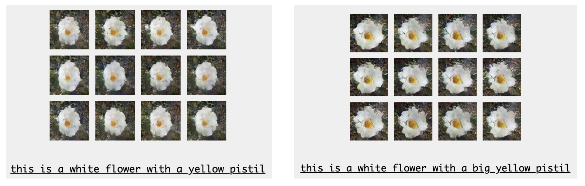
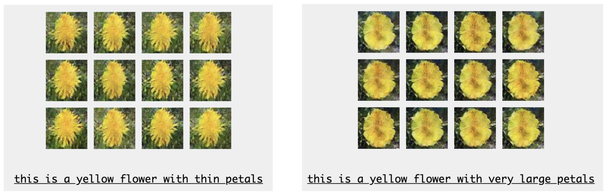
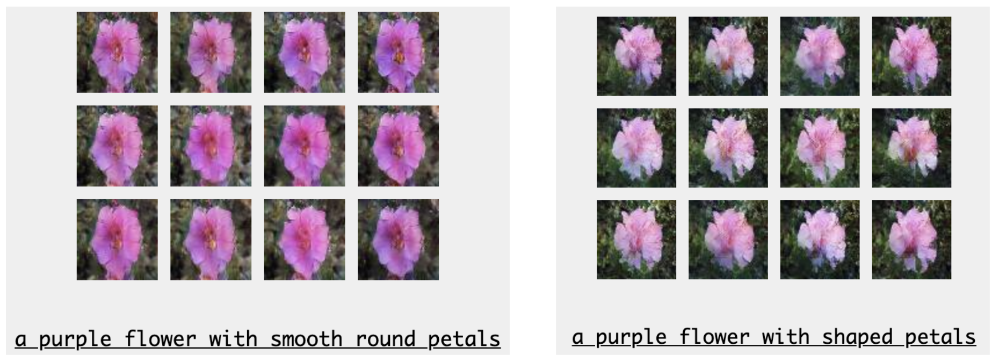
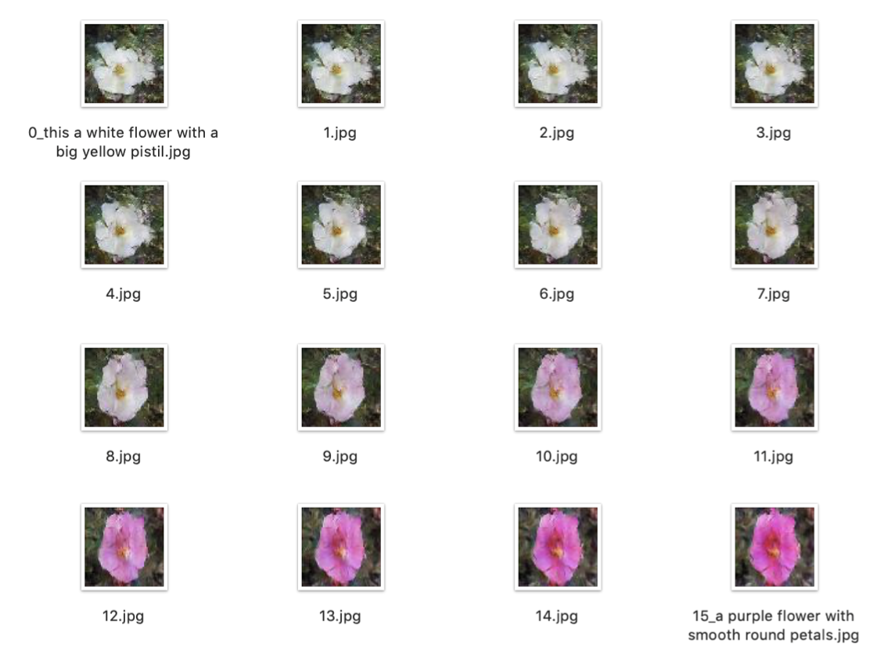
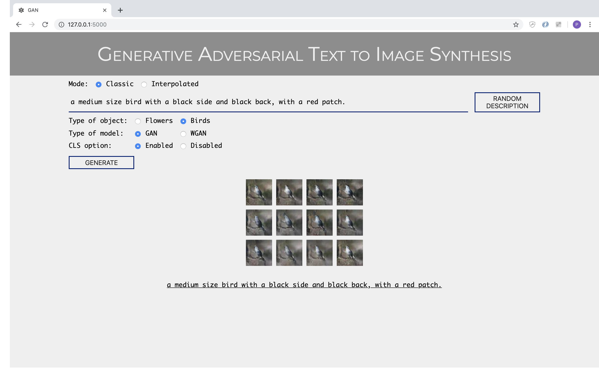
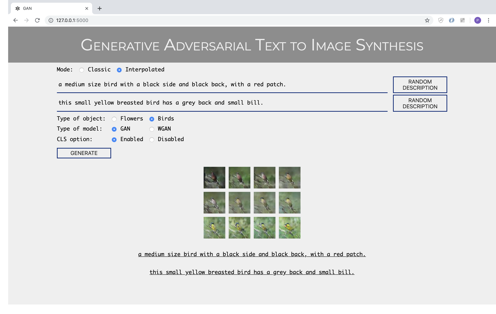
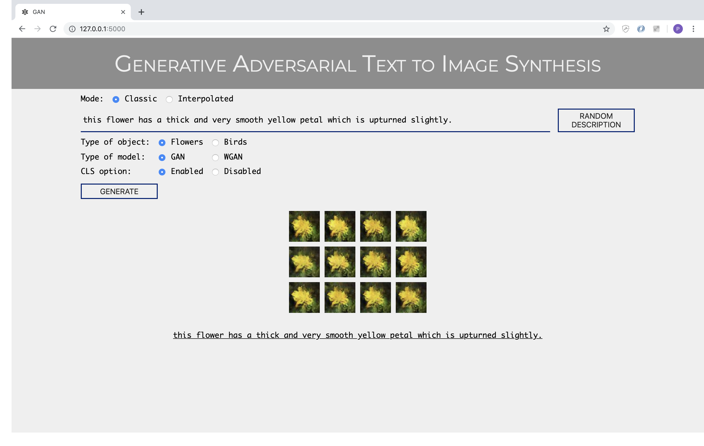
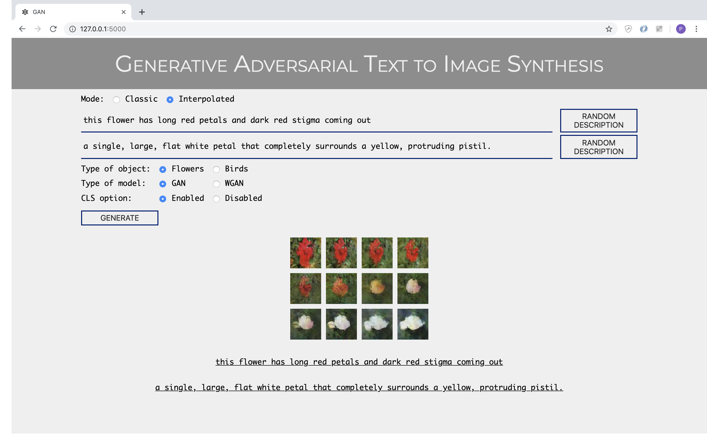

# Generative Adversarial Text to Image Synthesis

This project is based on Reed Scott's article [Generative Adversarial Text-to-Image Synthesis](https://arxiv.org/abs/1605.05396) and builds on its implementation by [Alaa El-Nouby](https://github.com/aelnouby/Text-to-Image-Synthesis). The originality of our work consists of two points: 
* the implementation of a test function that was not present at the base at Alaa El-Nouby;
* the creation of embeddings based on [InferSent](https://github.com/facebookresearch/InferSent) which is a different language model from the one used by Reed Scott.

A report for this project is available [here](https://drive.google.com/open?id=1T_mjcS-bOJ9QpskBmkN2DhW2jcPj5AqZ) and the PDF file that was used for the class presentation on the 03/28/2019 is also available [here](https://drive.google.com/open?id=1mn9TQtpkRnBvLuiPcBTV3JbLZBXOOfTc).

## Pre-trained models

Link towards the pre-trained discriminators and generators for [flowers](https://drive.google.com/drive/folders/1t7oe08tRkWAsX16PE_tcKIR1Bz2k_yF4?usp=sharing) and [birds](https://drive.google.com/drive/folders/1WzbQ0ePGMNLVXWVMSOmQ0pGPZEL3IEg0?usp=sharing).

## Datasets

To reproduce the results, you can download the datasets [Caltech-UCSD Birds 200](http://www.vision.caltech.edu/visipedia/CUB-200.html) and [Flowers](http://www.robots.ox.ac.uk/~vgg/data/flowers/102/) which contain the images, their captions and corresponding embeddings.

However, we will use the embeddings that we designed with Infersent, and that are available here (files in h5 format):
* [flowers_infersent](https://drive.google.com/open?id=1QNo5hqzWQhJOB2zjl0xyLgDHshL_iLl5) ;
* [birds_infersent](https://drive.google.com/open?id=1f_eXTUqlYSI7MurSIFhunzsRES3Pu6Ph).

### Embeddings

Link to the language models, necessary to do the tests yourself: [birds](https://drive.google.com/open?id=1VISSkPvNZebwAazCtDVbry2YadDjA2iy) and [flowers](https://drive.google.com/open?id=1EFsmlcL19rSXTdpJF7v71og6YOapkGUW).

If you want to generate them yourself, the files used are in the InferSent folder, and you must refer to the [Infersent GitHub](https://github.com/facebookresearch/InferSent) to make them work.

### Generate the h5py files needed for training

Once the datasets have been downloaded and embeddings created, just use `convert_cub_to_hd5_script.py` and `convert_flowers_to_hd5_script.py` (fill in `config.yaml` correctly to make the scripts work).

## Running

First of all, you must use the file `config.yaml` and fill in the corresponding paths for each field. Only the fields `model_path` and `dataset_path` are required if you already have the pre-trained files, and if you only want to do the test phase, only `model_path` is required.

### Training

To train the model, you must: 
* select the relevant arguments in `runtime.py`;
  * `--inference, default=False` for training and `default=True` for testing;
  * `--cls`, select the desired value;
  * `--pre_trained_disc` and `--pre_trained_gen` with `default=None` for training and the path corresponding to the models pre-trained for the test;
  * `--dataset` with the value `birds` or `flowers`;
  * `--num_workers, default=0` change the value if using multiprocessing;
  * `--epochs, default=200` is the recommended value;
  * you do not need to change the other values.
* launch `visdom` and open your browser at the address indicated to see the evolution of the model in real time (generation of images by batch and ploting of the loss functions of the generator and the discriminator);
* run `python runtime.py`;
* checkpoints will appear in the `checkpoints` folder every 10 epochs.

### Test

To test the model, you must:
* select the relevant arguments in `runtime.py`;
  * `--inference, default=True` for the test;
  * `--pre_trained_disc` and `--pre_trained_gen` with `default=/my/path/disc_190.pth` (for example) for the test;
  * `--dataset` with the value `birds` or `flowers`;
  * `--save_path` refers to the name of the folder in which the results will be generated
  * the other values do not matter.
* run `python runtime.py` (no need for `visdom`);
* the generated images will appear in the folder indicated by `--save_path`.

### Evaluation

For this project we did not use mathematical functions for the evaluation of the model. The use of appropriate evaluation metrics for GANs being an active research subject, we preferred to evaluate our model in a more simplistic way using the understanding of the text that the generator is supposed to respect. On the following pictures of flowers you can see that the vocabulary in question is well understood. White vs Yellow vs Purple, Big vs Large vs Thin, etc. The best results are obtained for flowers that have a less complex learning distribution than birds, for example. The results obtained can be tested on the website provided.

  

    
  

  

    
  

  

    
  

### Interpolation

It is also possible to interpolate the embeddings and generate the associated images. Below is an example of the results obtained.

  

    
  

It is possible to reproduce the interpolated results using the website provided.

## Website

A website (local mode) allows you to generate images with the pre-trained models provided above from your own descriptions. Below are some examples of possible generations. See the `Website` folder for more information about launching it in local mode.

  

    
  

  

    
  

  

    
  

  

    
  

## Authors

* Antoine ABHAY
* Paola de PERTHUIS
* Pascal GODBILLOT
* Théo LACOUR

## Acknowledgements
Special thanks to Mr. Liming Chen for being our tutor for this project, and to Daniel Muller and Mohsen Ardabilian for their constructive criticism.
