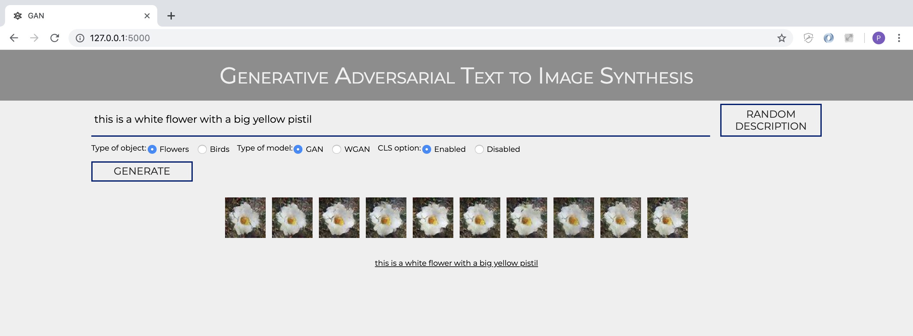

# Projet_GAN

Ce projet a pour point de départ l'article de Reed Scott [Generative Adversarial Text-to-Image Synthesis](https://arxiv.org/abs/1605.05396) et s'appuie sur l'implémentation qui en a été faite par [Alaa El-Nouby](https://github.com/aelnouby/Text-to-Image-Synthesis). L'originalité de notre travail consiste en deux points : 
* l'implémentation d'une fonction de test qui n'était pas présente à la base chez Alaa El-Nouby ;
* la création d'embeddings basés sur [InferSent](https://github.com/facebookresearch/InferSent) qui constitue un modèle de langage différent de celui utilisé par Reed Scott.

## Pre-trained models

Lien vers les discriminateurs et générateurs pré-entrainés [flowers](https://drive.google.com/open?id=1XtlZflv0Hz_Fjz3eKpPm3uHpscaH6Js9), [flowers_cls](https://drive.google.com/open?id=1kWhoLbw81IV6wzyq2yj9uzrVCWSb0-Id), [birds](https://drive.google.com/open?id=1GHaASXrzDqqyxiS8pMn_lw_ceVpQdlTb) et [birds_cls](https://drive.google.com/open?id=1RLsRETS2jIrLXzvTJaEMd4rUV8dR_mNu)

## Datasets

Pour reproduire les résultats obtenus, vous pouvez télécharger les datasets [Caltech-UCSD Birds 200](http://www.vision.caltech.edu/visipedia/CUB-200.html) et [Flowers](http://www.robots.ox.ac.uk/~vgg/data/flowers/102/) qui contiennent les images, leurs légendes et les embeddings correspondants.

Cependant, nous utiliserons les embeddings que nous avons conçu grâce à Infersent, et qui sont disponibles ici (fichiers au format h5):
* [flowers_infersent](https://drive.google.com/open?id=1QNo5hqzWQhJOB2zjl0xyLgDHshL_iLl5) ;
* [birds_infersent](https://drive.google.com/open?id=1f_eXTUqlYSI7MurSIFhunzsRES3Pu6Ph)

### Embeddings

Lien vers les modèles de langage, nécessaire pour faire soi-même les tests : [birds](https://drive.google.com/open?id=1VISSkPvNZebwAazCtDVbry2YadDjA2iy) et [flowers](https://drive.google.com/open?id=1EFsmlcL19rSXTdpJF7v71og6YOapkGUW).

Si vous souhaitez les générer vous-même, les fichiers utilisés sont dans le dossier InferSent, et il faut se référer au [GitHub de Infersent](https://github.com/facebookresearch/InferSent) pour les faire fonctionner.

### Générer les fichiers h5py nécessaires à l'entrainement

Une fois les datasets télechargés et les embeddings créés, il suffit d'utiliser `convert_cub_to_hd5_script.py` et `convert_flowers_to_hd5_script.py` (remplissez `config.yaml` correctement afin de faire fonctionner les scripts).

## Fonctionnement

Il faut tout d'abord utiliser le fichier `config.yaml` et remplir les chemins correspondants pour chaque champs. Seuls les champs `model_path` et `dataset_path` sont nécessaires si vous avez déjà les fichiers pré-entrainés, et si vous voulez uniquement faire la phase de test, seul `model_path` est nécessaire.

### Entrainement

Pour entrainer le modèle, il faut : 
* choisir les arguments pertinents dans `runtime.py`
  * `--inference, default=False` pour l'entrainement et `default=True` pour le test.
  * `--cls`, sélectionner la valeur désirée.
  * `--pre_trained_disc` et `--pre_trained_gen` avec `default=None` pour l'entrainement et le chemin correspondant aux modèles pré-entrainés pour le test.
  * `--dataset` avec la valeur `birds` ou `flowers`.
  * `--num_workers, default=0` changer la valeur si on utilise le multiprocessing.
  * `--epochs, default=200` c'est la valeur recommandée.
  * vous n'avez pas besoin de modifier les autres valeurs.
* lancer `visdom` et ouvrir son navigateur à l'adresse indiquée pour voir l'évolution du modèle en temps réel.
* lancer `python runtime.py`
* les checkpoints vont apparaitre dans le dossier `checkpoints` toutes les 10 epochs.

### Test

Pour tester le modèle, il faut :
* choisir les arguments pertinentes dans `runtime.py`
  * `--inference, default=True` pour le test.
  * `--pre_trained_disc` et `--pre_trained_gen` avec `default=/my/path/disc_190.pth` (par exemple) pour le test.
  * `--dataset` avec la valeur `birds` ou `flowers`.
  * `--save_path` désigne le nom du dossier dans lequel vont être générés les résultats
  * les autres valeurs n'ont pas d'importance.
* lancer `python runtime.py` (pas besoin de `visdom`)
* les images générées vont apparaître dans le dossier indiqué par `--save_path`

### Website

Un site web  (mode local) permet de générer des images avec les modèles pré-entraînés fournis plus haut à partir de vos propres descriptions. Consultez le dossier `Website`pour en savoir plus.

  

    
  

### Remerciements
Merci à M. Liming Chen d'avoir été notre tuteur pour ce projet, ainsi qu'à Daniel Muller et à Mohsen Ardabilian pour leurs critiques constructives.
