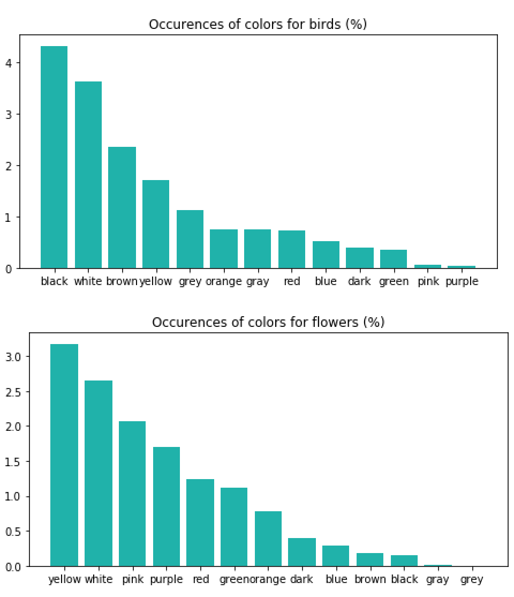
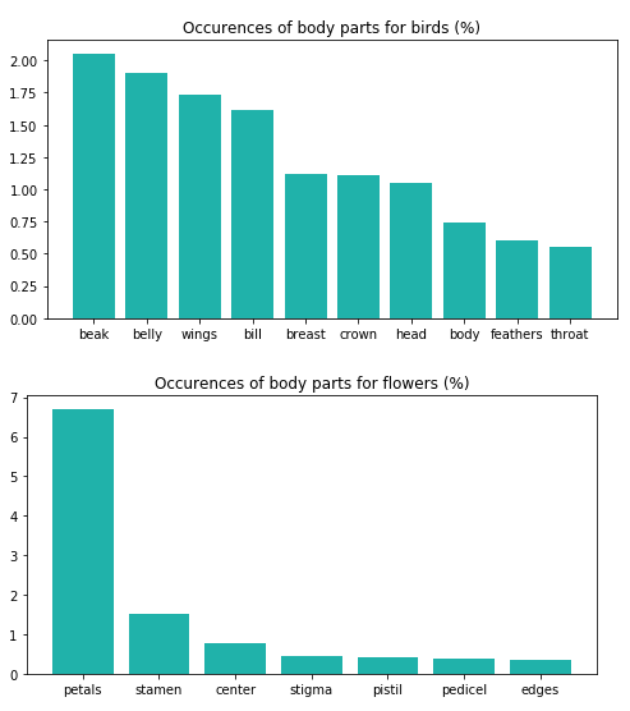
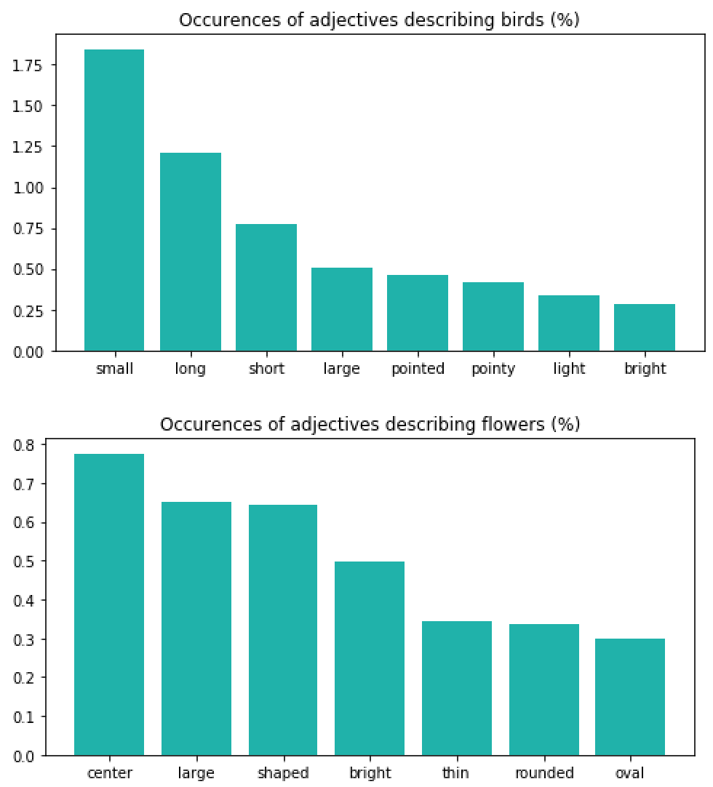

# Dataset Vocabulary

* La fonction `vocabulary.py`permet de générer la totalité du vocabulaire présent dans les textes descriptifs liés aux images des datasets [Birds 200](http://www.vision.caltech.edu/visipedia/CUB-200.html}{Caltech-UCSD) et [Flowers](http://www.robots.ox.ac.uk/~vgg/data/flowers/102/). Les descriptions au format `.txt` sont disponibles au téléchargement sur le github de Reed Scoot dans le repository [cvpr2016](https://github.com/reedscot/cvpr2016).

* Cependant les datasets en question étant très lourds, les vocabulaires pour chaque dataset ainsi que le nombre d'occurence de chaque mot sont disponibles dans les fichiers `.json`

* La fonction `vocabulary.py` permet également de générer différents insights à partir de ces vocabulaires. Certains sont présentés dans les barplots ci-dessous.

